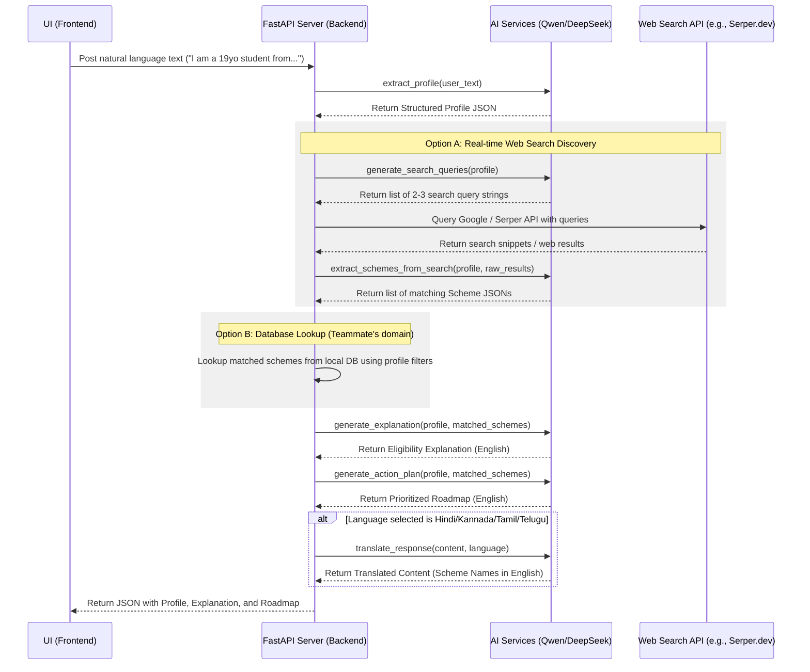

# SchemeSathi AI Module: Integration Guide

This guide is designed for the backend and frontend teammates of **SchemeSathi** to integrate the AI layer into the main application.

---

## 1. Overview of the AI Pipeline

The AI module acts as the cognitive layer. It extracts demographics, plans search queries, parses search outputs into database-compatible schemes, explains eligibility, prioritizes the application steps, and translates responses into 5 languages.



---

## 2. Environment Variables & Setup

Your teammates need to include the following key in their root `.env` file:

```bash
NEBIUS_API_KEY=your_nebius_api_key_here
```

### Installation
Teammates should run the following in the `ai/` folder:
```bash
pip install -r requirements.txt
```

---

## 3. Core API Functions

Exported from `ai/services/__init__.py`:

```python
from services import (
    extract_profile,
    generate_search_queries,
    extract_schemes_from_search,
    generate_explanation,
    generate_action_plan,
    translate_response
)
```

| Function | Input | Output | Target Model |
| :--- | :--- | :--- | :--- |
| `extract_profile` | `user_text: str` | `dict` (JSON Profile Schema) | `Qwen/Qwen3-32B` |
| `generate_search_queries` | `profile: dict` | `list[str]` (Search Queries) | `Qwen/Qwen3-235B-A22B-Instruct-2507` |
| `extract_schemes_from_search` | `profile: dict, search_results: str` | `list[dict]` (List of Schemes) | `Qwen/Qwen3-235B-A22B-Instruct-2507` |
| `generate_explanation` | `profile: dict, schemes: list` | `str` (Detailed Explanation) | `Qwen/Qwen3-235B-A22B-Instruct-2507` |
| `generate_action_plan` | `profile: dict, schemes: list` | `str` (Prioritized Roadmap) | `Qwen/Qwen3-235B-A22B-Thinking-2507-fast` |
| `translate_response` | `text: str, language: str` | `str` (Translated Text) | `deepseek-ai/DeepSeek-V3.2` |

---

## 4. FastAPI Backend Integration Code Example

Below is a complete backend implementation template. Your backend teammate can drop this into their code (e.g. `main.py`) to serve the frontend:

```python
import os
import requests
from fastapi import FastAPI, HTTPException
from pydantic import BaseModel, Field
from typing import List, Optional, Dict, Any

# Ensure python can locate the 'ai' package folders
import sys
sys.path.insert(0, os.path.abspath(os.path.join(os.path.dirname(__file__), "ai")))

from services import (
    extract_profile,
    generate_search_queries,
    extract_schemes_from_search,
    generate_explanation,
    generate_action_plan,
    translate_response
)

app = FastAPI(title="SchemeSathi AI Backend Services API")

# Define request/response structures
class TextRequest(BaseModel):
    text: str
    language: Optional[str] = "English"

class SchemeItem(BaseModel):
    name: str
    category: str
    description: str
    benefit: str
    required_documents: List[str]

class ProcessedResponse(BaseModel):
    profile: Dict[str, Any]
    schemes: List[SchemeItem]
    explanation: str
    roadmap: str

# Helper: Google/Serper Web Search executor
def execute_web_search(queries: List[str]) -> str:
    """
    Executes search queries against Serper.dev or standard search API,
    merging results to feed into the extraction agent.
    """
    api_key = os.getenv("SERPER_API_KEY") # optional search token
    if not api_key:
        # Fallback to empty context or mock results if no API key is provided
        return ""
    
    headers = {"X-API-KEY": api_key, "Content-Type": "application/json"}
    combined_results = []
    
    # Run the top 2 queries
    for query in queries[:2]:
        try:
            res = requests.post(
                "https://google.serper.dev/search",
                json={"q": query},
                headers=headers,
                timeout=5
            )
            if res.status_code == 200:
                data = res.json()
                # Aggregate snippets from organic search results
                snippets = [item.get("snippet", "") for item in data.get("organic", [])]
                combined_results.append(f"Query: {query}\n" + "\n".join(snippets))
        except Exception as e:
            print(f"Error querying Search API: {e}")
            
    return "\n\n".join(combined_results)


@app.post("/api/process-scheme-finder", response_model=ProcessedResponse)
def process_scheme_finder(request: TextRequest):
    """
    Primary API Endpoint matching the complete SchemeSathi workflow.
    """
    if not request.text.strip():
        raise HTTPException(status_code=400, detail="User input text is empty.")
        
    try:
        # 1. Extract Profile parameters from user text input
        profile = extract_profile(request.text)
        
        # 2. Scheme Discovery: Generate Web Search Queries
        search_queries = generate_search_queries(profile)
        
        # 3. Scheme Discovery: Execute search queries & parse raw snippets into schemes
        raw_web_data = execute_web_search(search_queries)
        
        # Parse the raw results using the Discoverer LLM
        discovered_schemes = []
        if raw_web_data.strip():
            discovered_schemes = extract_schemes_from_search(profile, raw_web_data)
            
        # Fallback default schemes if search yielded no items
        if not discovered_schemes:
            discovered_schemes = [
                {
                    "name": "Karnataka Post-Matric Scholarship for OBC students",
                    "category": "Scholarship",
                    "description": "Post-Matric scholarships for students belonging to OBC category.",
                    "benefit": "₹25,000 per annum and waiver of hostel fees",
                    "required_documents": ["Aadhaar Card", "Caste Certificate", "Income Certificate"]
                }
            ]
            
        # 4. Generate Explanations of eligibility
        explanation = generate_explanation(profile, discovered_schemes)
        
        # 5. Generate prioritized application roadmap
        roadmap = generate_action_plan(profile, discovered_schemes)
        
        # 6. Apply regional translation if selected
        lang = request.language.strip()
        if lang.lower() != "english":
            explanation = translate_response(explanation, lang)
            roadmap = translate_response(roadmap, lang)
            
        return ProcessedResponse(
            profile=profile,
            schemes=discovered_schemes,
            explanation=explanation,
            roadmap=roadmap
        )
        
    except Exception as e:
        raise HTTPException(status_code=500, detail=f"Internal Server Error: {str(e)}")
