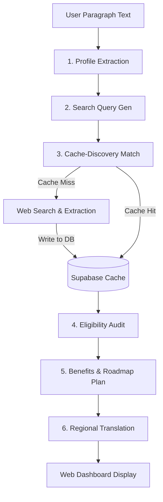

# SchemeSathi AI Architecture & Workflow Guide

This guide details the AI routing strategy, task-level model assignments, and step-by-step methodology workflows of the **SchemeSathi** AI Layer.

---

## 1. Models & Task Allocations

SchemeSathi connects exclusively to **Nebius AI Studio** (using an OpenAI-compatible interface) to leverage specialized open-weights LLMs. Requests are routed dynamically based on task requirements:

| Task / Agent | Model Used | Reason for Model Selection |
| :--- | :--- | :--- |
| **Profile Extraction** | `Qwen/Qwen3-235B-A22B-Instruct-2507` (TS)<br>`Qwen/Qwen3-32B` (Python Prototype) | Highly accurate at structured JSON extraction. Handles decimal conversions (e.g. hectares to acres) and salary multiplying. |
| **Search Query Generation** | `Qwen/Qwen3-235B-A22B-Instruct-2507` | Understands search engine operators (`site:`) and generates queries optimized for Google indexing. |
| **Web Scheme Extraction** | `Qwen/Qwen3-235B-A22B-Instruct-2507` | Excellent context comprehension for parsing raw web content/snippets into structured scheme objects. |
| **Eligibility Reasoning** | `deepseek-ai/DeepSeek-V3.2` | High-reasoning model optimized for complex rule-matching (state, category, income, age, gender) and step-by-step logic. |
| **Benefits & Roadmap Analysis**| `Qwen/Qwen3-235B-A22B-Instruct-2507` | Excellent at categorization, sorting priorities, and estimating values. |
| **Multilingual Translation** | `deepseek-ai/DeepSeek-V3.2` | Translates explanations and plans into Hindi, Kannada, Tamil, and Telugu, while strictly keeping English scheme names intact. |

---

## 2. Methodology & Workflow Pipeline

The SchemeSathi E2E pipeline orchestrates data flow in **six distinct steps**:



### Step 1: Profile Demographics Extraction
* **Purpose**: Parse raw, messy natural language inputs (e.g., *"I'm a farmer from TN with 2 acres land and family income of 1.2 lakh"*) into a strict, typed schema.
* **Logic**: The extractor translates terms (e.g., "dalit" $\rightarrow$ `SC`, "adivasi" $\rightarrow$ `ST`), normalizes numeric quantities (e.g., "1.2 lakh" $\rightarrow$ `120000`), and converts land metrics (e.g., hectares to acres).

### Step 2: Search Query Generation
* **Purpose**: Formulate search queries to find the most up-to-date central and state-specific schemes.
* **Logic**: Formulates queries by layering user traits. It targets official sites (using `site:myscheme.gov.in`, `site:msme.gov.in`, etc.) and adds localized state keywords, occupation tags, and caste/category criteria.
* **Fallback**: If the AI model is rate-limited, the system automatically falls back to deterministic rule-based query templates.

### Step 3: Cache-Discovery & Web Retrieval
* **Purpose**: Retrieve matching schemes from the database, and trigger web search discovery if matching coverage is low.
* **Workflow**:
  1. **Cache Lookup**: Queries the Supabase database `scheme_cache` table for schemes matching the user's state and general tags.
  2. **Heuristic Scoring**: Ranks schemes using a custom relevance scoring matrix (Occupations: 30%, State: 25%, Social Category: 20%, Tags: 15%, Income: 10%).
  3. **Trigger Discovery**: If no matching schemes exist, the discovery module queries the web for the generated queries, extracts structured schemes from snippets, and writes them to the Supabase cache.
  4. **UNIQUE Constraint Bypass**: To prevent database conflicts, write operations run JS-level checks to insert new schemes or update existing ones without failing on database `ON CONFLICT` errors.

### Step 4: Eligibility Audit
* **Purpose**: Check the user profile against each retrieved scheme's rules to assess whether they qualify.
* **Logic**: Executes a detailed reasoning pass checking:
  - Is the state correct?
  - Does the occupation qualify?
  - Is the income below the threshold?
  - Do age, gender, and social category match?
* **Output classification**: Categorizes as `Eligible`, `Possibly Eligible`, or `Not Eligible` with a reasoning text and confidence score.

### Step 5: Benefits & Roadmap Analysis
* **Purpose**: Structure next steps and calculate monetary values.
* **Logic**: Categorizes each scheme (Direct Benefit, Subsidy, Loan, Insurance, etc.) and sums up values. It then generates concrete action steps (e.g., *"Apply on NSP Portal"*) and sorts them by priority.

### Step 6: Multilingual Translation
* **Purpose**: Provide regional accessibility.
* **Logic**: Translates final outputs into Hindi, Kannada, Tamil, or Telugu. It guarantees that the core scheme name is kept strictly in English to prevent confusion during formal applications.

---

## 3. Search Query & Processing Example

Here is a walkthrough of how the query **"I am a 19 year old engineering student from Karnataka. My family income is around 3 lakh. I belong to OBC category."** is processed:

### 1. Profile Extracted (JSON)
```json
{
  "age": 19,
  "gender": "Male",
  "state": "Karnataka",
  "occupation": "Student",
  "income": 300000,
  "category": "OBC",
  "education": "Graduate",
  "business_type": "None",
  "turnover": 0,
  "land_holding": 0
}
```

### 2. Search Queries Formulated
* `site:myscheme.gov.in student schemes`
* `scholarship schemes for OBC students India`
* `site:scholarships.gov.in OBC scholarship`
* `Karnataka state scholarship schemes`
* `government welfare schemes Karnataka India`

### 3. Scoring & Matching (Cache)
* **Scheme**: *Karnataka Post-Matric Scholarship for OBC Students*
  - **Occupation**: Student matches Student $\rightarrow$ +30 pts
  - **State**: Karnataka matches Karnataka $\rightarrow$ +25 pts
  - **Social Category**: OBC matches OBC $\rightarrow$ +14 pts
  - **Tags**: "scholarship" $\rightarrow$ +8 pts
  - **Income**: Income ₹3L is within limits $\rightarrow$ +3 pts
  - **Total Relevance Score**: **80/100** (High priority classification)

### 4. Eligibility Reasoning (DeepSeek V3.2)
* **Status**: `Eligible`
* **Confidence**: `95%`
* **Reason**: *"User is a student residing in Karnataka belonging to the OBC social category. Family income of ₹3,00,000 per annum is below the scheme's limit of ₹4,50,000 per annum. All criteria met."*
