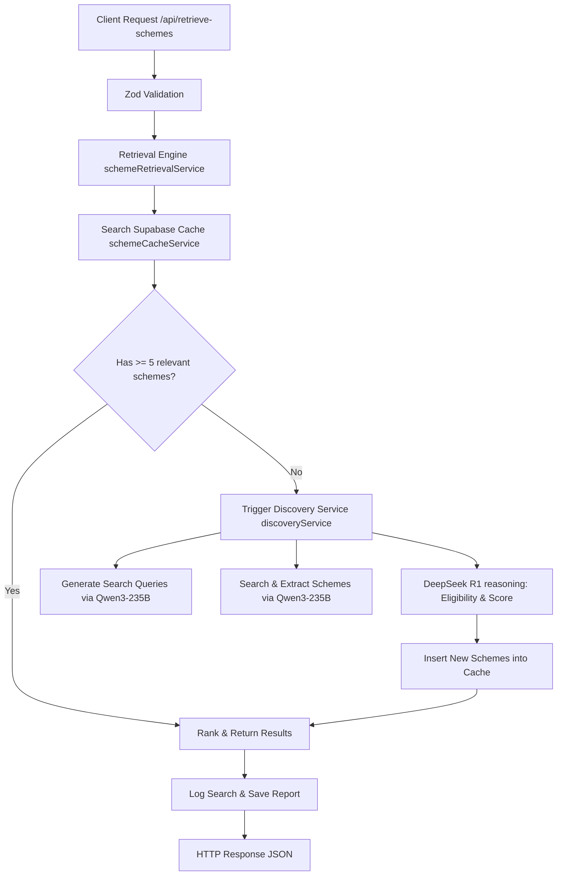

# SchemeSathi Integration Guide 🚀
This document serves as a comprehensive guide for developers on the SchemeSathi backend engine. It details the architecture, configuration, core service layers, database setup, and test suites so you can seamlessly integrate this engine into the overall project.

---

## 📌 Architecture Overview

SchemeSathi is designed around a **retrieval-augmented hybrid discovery pipeline** for Indian government schemes. The engine evaluates user eligibility locally when cached data is sufficient, and automatically triggers an LLM-powered discovery service using **Nebius AI** when coverage is low.

### System Workflow


---

## ⚙️ Configuration & Environment

To run the backend, create or update the `.env` file in the root of the project with the following variables:

```env
# Supabase Configuration
SUPABASE_URL=your_supabase_url
SUPABASE_SERVICE_ROLE_KEY=your_supabase_service_role_key

# Nebius AI LLM Config
NEBIUS_API_KEY=your_nebius_api_key
```

---

## 🗄️ Database Setup (Supabase)

Make sure the following tables exist in your Supabase database. You can run this directly in the SQL Editor of your Supabase dashboard:

```sql
-- 1. Cache Table for Government Schemes
CREATE TABLE public.scheme_cache (
    id UUID PRIMARY KEY DEFAULT gen_random_uuid(),
    scheme_name TEXT UNIQUE NOT NULL,
    category TEXT,
    description TEXT,
    eligibility TEXT,
    benefits TEXT,
    benefit_value NUMERIC DEFAULT 0,
    source_url TEXT,
    states TEXT[] NOT NULL DEFAULT '{}',
    tags TEXT[] NOT NULL DEFAULT '{}',
    ministry TEXT,
    fetched_at TIMESTAMPTZ DEFAULT NOW()
);

-- Indexing for state/tag searching
CREATE INDEX idx_scheme_cache_states ON public.scheme_cache USING gin(states);
CREATE INDEX idx_scheme_cache_tags ON public.scheme_cache USING gin(tags);

-- 2. Search Logs Table
CREATE TABLE public.search_logs (
    id UUID PRIMARY KEY DEFAULT gen_random_uuid(),
    profile JSONB NOT NULL,
    query_string TEXT,
    results_returned INT DEFAULT 0,
    discovery_triggered BOOLEAN DEFAULT FALSE,
    created_at TIMESTAMPTZ DEFAULT NOW()
);

-- 3. Generated Reports Table
CREATE TABLE public.generated_reports (
    id UUID PRIMARY KEY DEFAULT gen_random_uuid(),
    profile JSONB NOT NULL,
    scheme_count INT NOT NULL,
    total_benefits NUMERIC NOT NULL DEFAULT 0,
    results JSONB NOT NULL DEFAULT '[]'::jsonb,
    created_at TIMESTAMPTZ DEFAULT NOW()
);
```

---

## 📂 Backend File Structure

The core backend files are organized as follows under the `TOKEN_FACTORY/backend` directory:

```bash
backend/
├── api/
│   └── retrieve-schemes/
│       └── route.ts             # API endpoint POST /api/retrieve-schemes
├── lib/
│   ├── nebiusClient.ts          # Nebius API connection and prompt logic
│   ├── supabase.ts              # Supabase Client initializations
│   └── supabaseClient.ts
├── services/
│   ├── schemeCacheService.ts    # Cache Reads, Writes, Searching, and Logging
│   ├── discoveryService.ts      # LLM discovery coordinator
│   └── schemeRetrievalService.ts# Core Orchestrator (Cache first -> LLM Discovery fallback)
├── tests/
│   ├── e2e.integration.ts       # 9-stage full integration suite
│   └── testSchemeRetrieval.ts   # Multi-profile batch test runner
└── types.ts                     # Strongly-typed TypeScript interfaces
```

---

## 🛠️ Key Interfaces (`types.ts`)

These are the primary models used across all layers:

```typescript
export interface UserProfile {
  age: number;
  gender: Gender;            // "Male" | "Female" | "Transgender" | "Other"
  state: IndianState;        // e.g. "Karnataka", "Tamil Nadu", "All India"
  occupation: OccupationType; // e.g. "Student", "Farmer", "Business Owner"
  income: number;
  category: SocialCategory;  // "General" | "OBC" | "SC" | "ST" | "EWS" | "Minority"
  education: EducationLevel;
  business_type: BusinessType;
  turnover: number;
  land_holding: number;      // In acres
}

export interface GovernmentScheme {
  id: string;
  scheme_name: string;
  category: string | null;
  description: string | null;
  eligibility: string | null;
  benefits: string | null;
  benefit_value: number;
  source_url: string | null;
  states: string[];
  tags: string[];
  ministry: string | null;
  fetched_at: string;
}
```

---

## 🧠 Services & Components Walkthrough

### 1. Nebius AI Client (`lib/nebiusClient.ts`)
Interacts with Nebius Studio to prompt LLMs for structured extractions and reasoning.
* **Extraction Model:** `Qwen3.5` (or similar configured model) is utilized to generate search queries from profiles, and to parse raw webpage texts into structured scheme JSONs.
* **Reasoning Model:** `DeepSeek-R1` is utilized to check eligibility constraints and score relevancy, outputting formatted JSON details.
* *Note:* Strips out `<think>...</think>` tags generated by DeepSeek reasoning before routing JSON output to Zod parser.

### 2. Scheme Cache Service (`services/schemeCacheService.ts`)
Manages reads/writes to Supabase, search logging, and reports storage.
* `getCachedSchemes()` & `searchCache(profile)`: Filter cached schemes by user state, income limits, and matching category tags.
* `saveDiscoveredScheme()` & `saveMultipleSchemes(schemes)`: Insert new entries into `scheme_cache`.
* `logSearch(profile, count, triggered)`: Records a log in `search_logs`.
* `saveReport(profile, results)`: Generates and persists the full user diagnostic report in `generated_reports`.

### 3. Discovery Service (`services/discoveryService.ts`)
Discovers new schemes in real-time when cache counts fall short.
1. Generates 3–5 targeted search terms based on user profile factors.
2. Simulates search engine extraction or crawls targets.
3. Invokes Nebius extraction APIs.
4. Normalizes scheme data and stores it in the database cache.

### 4. Scheme Retrieval Service (`services/schemeRetrievalService.ts`)
Orchestrates the entire logic flow:
1. Performs database cache query filtering by `UserProfile` attributes.
2. Invokes local scoring (or LLM scoring if needed) to rank schemes.
3. If fewer than **5** valid schemes are retrieved:
   - Triggers `discoveryService.discoverSchemes(profile)`.
   - Combines cache hits with newly discovered schemes.
4. Returns the ranked set of programs.

---

## 🌐 API Endpoint (`POST /api/retrieve-schemes`)

**Route:** `POST /api/retrieve-schemes`

### Request Body
```json
{
  "profile": {
    "age": 21,
    "gender": "Female",
    "state": "Maharashtra",
    "occupation": "Student",
    "income": 120000,
    "category": "OBC",
    "education": "Graduate",
    "business_type": "None",
    "turnover": 0,
    "land_holding": 0
  }
}
```

### Success Response (`200 OK`)
```json
{
  "success": true,
  "schemes": [
    {
      "id": "e7b0d774-...",
      "scheme_name": "Post-Matric Scholarship for OBC Students",
      "benefit_value": 25000,
      "match_score": 95,
      "remarks": "Fully eligible based on state, category, and income limits."
    }
  ],
  "meta": {
    "totalFound": 1,
    "averageScore": 95,
    "fromCache": 1,
    "fromDiscovery": 0,
    "discoveryTriggered": false,
    "durationMs": 145
  }
}
```

---

## 🧪 Running Integration Tests

Two test files are provided to make sure all modules operate together correctly.

### 1. Multi-Profile Retrieval Test (`tests/testSchemeRetrieval.ts`)
Iterates through 4 distinct mock profiles (Student, Farmer, Woman Entrepreneur, MSME Owner) and evaluates the engine's retrieval metrics.
```bash
npx tsx backend/tests/testSchemeRetrieval.ts
```

### 2. End-to-End Suite (`tests/e2e.integration.ts`)
Performs 9 stages of testing, tracing the flow from client-side POST inputs through parser validation, query generation, database writing, scoring logic, logging, and HTTP routes.
```bash
# Set your env variables, boot up your local dev server
npm run dev &

# Run the integration suite
npx tsx backend/tests/e2e.integration.ts
```
